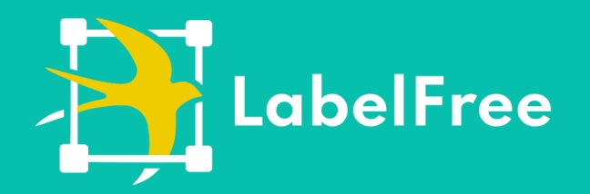

<a name="readme-top"></a>
[简体中文](./README.md) | English
<!-- PROJECT LOGO -->
<br />
<div align="center">
  <a href="https://github.com/IndustryEssentials/label-free">
    
  </a>

  <h3 align="center">Welcome to LabelFree👋👋👋</h3>

  <p align="center">
    LabelFree is an open, privately-deployable annotation system. It aims to provide an easy-to-use, reliable, and high-performance data annotation system to provide reliable underlying data support for algorithm services.<br /><br />
    LabelFree supports <b>Segment Anything</b> model for segmentation-assisted annotation 🚀🚀🚀
    <br />
    <a href="https://labelfree.gitee.io/label-free/"><strong>Explore the docs »</strong></a>
    <br />
    <br />
    ·
    <a href="https://github.com/IndustryEssentials/label-free/issues">Report Bug</a>
    ·
    <a href="https://github.com/IndustryEssentials/label-free/issues">Request Feature</a>
  </p>
</div>

</div>

<div align="center">
<table>
    <tr>
        <td></td>
        <td></td>
        <td></td>
    <tr>
    <tr>
        <td align="center">Object Detection</td>
        <td align="center">Image Segmentation</td>
        <td align="center">Image Classification</td>
    <tr>

</table>
</div>

<!-- TABLE OF CONTENTS -->
<details>
  <summary>Table of Contents</summary>
  <ol>
    <li>
      <a href="#features">Features</a>
    </li>
    <li>
      <a href="#getting-started">Getting Started</a>
    </li>
    <li>
      <a href="#user-guide">User Guide</a>
    </li>
  </ol>
</details>

## Features
- Everything is designed to improve the efficiency of annotation production. It provides powerful annotation interactive interface, rich shortcut keys, and smooth multi-person collaboration functions to make annotation more efficient.
- Support segmentation-assisted annotation based on **Segment Anything** model. Compared with traditional segmentation annotation, LabelFree provides interactive segmentation annotation, which can greatly improve the efficiency of annotation.
- Easy to deploy, based on Docker, can be deployed with just a few simple commands.
- High data security. It can be deployed in a private intranet, and there is no risk of data leakage.
- High performance. Native support for object storage, no restriction on the size of annotation data, and support for massive data annotation.
- One-click annotation. Provide professional, one-stop data annotation services.
<p align="right">(<a href="#top">back to top</a>)</p>

## Getting Started

1. Clone this repository
```bash
git clone https://github.com/IndustryEssentials/label-free.git

cd label-free
```

2. Start
```bash
docker-compose up -d
```

If you are using the `docker-compose-plugin`, please try:
```bash
docker compose up -d
```

*Note: System initialization takes about 60 seconds, please be patient.*

3. Access

```bash
http://localhost:8080
```

Default admin account and password:


```
labelfree@viesc.com
labelfree@2022
```
*If you find that you cannot create a project, please make sure that you login with the admin account.*

Everything is done, let's start labeling! 🍻🍻🍻
<p align="right">(<a href="#readme-top">Back to Top</a>)</p>

## User Guide

## 1. Create Project

**1.1 Create a new project**
Click the "Create Project" button to enter the project creation page.


**1.2 Set tag properties**
Enter the tag name in the input box on the right side, and set the tag name according to actual needs.


1.3 **Enter project description information**
The project name is an automatically generated random value, which can be changed according to actual needs.


1.4 **Upload dataset**
The dataset only supports zip compressed files, and does not include annotation information by default. If you want to upload a dataset that contains annotation information, put the images in the "images" folder and the annotation files in the "annotations" folder.


## 2. Labeling

After creating a project, click the labeling button to enter the labeling process.


### Common Shortcut Keys

| Key         | Function     |
| ----------- | ------------ |
| Q           | Draw box continuously |
| W           | Draw single box |
| R           | Draw box with four points |
| S           | Submit |
| A           | Switch to previous image |
| D           | Switch to next image |
| Z           | Undo |
| V           | Redo |
| Delete      | Delete |
| Scroll / + / -  | Zoom image |
| M           | Move image |
| F           | Hide category |
| G           | Hide property |
| H           | Hide selected |
| X           | Show only selected |
| K           | Show all |
| C           | Clear all |

For more information, please refer to the documentation center: [https://industryessentials.github.io/label-free/](https://industryessentials.github.io/label-free/)