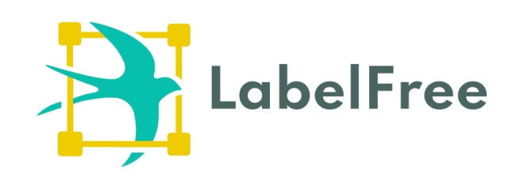

<a name="readme-top"></a>

<!-- PROJECT LOGO -->
<br />
<div align="center">
  <a href="https://github.com/IndustryEssentials/label-free">
    
  </a>

  <h3 align="center">欢迎使用LabelFree👋👋👋</h3>

  <p align="center">
    Labelfree 是一个开放的、可私有化部署的标注系统。旨在提供一个操作简单、数据可靠、高性能的数据标注系统，为算法服务提供可靠的底层数据支撑。
    <br />
    <a href="https://industryessentials.github.io/label-free/"><strong>文档 »</strong></a>
    <br />
    <br />
    ·
    <a href="https://github.com/IndustryEssentials/label-free/issues">反馈</a>
    ·
    <a href="https://github.com/IndustryEssentials/label-free/issues">讨论</a>
  </p>
</div>


</div>

<div align="center">
<table>
    <tr>
        <td></td>
        <td></td>
    <tr>
    <tr>
        <td align="center">目标检测</td>
        <td align="center">图像分割</td>
    <tr>

</table>
</div>

<!-- TABLE OF CONTENTS -->
<details>
  <summary>目录</summary>
  <ol>
    <li>
      <a href="#特性">特性</a>
    </li>
    <li>
      <a href="#一键部署">一键部署</a>
    </li>
    <li>
      <a href="#使用指南">使用指南</a>
    </li>
  </ol>
</details>

## 特性
- 一切为了提升标注生产效率。提供强大的标注交互界面、丰富的快捷键、流畅的多人协作等功能，让标注更加高效。
- 支持交互式辅助分割标注。对比传统的分割标注，LabelFree 提供了交互式的分割标注，可以大大提升标注效率。
- 易于部署，基于 Docker ，简单几条命令即可部署。
- 数据安全性高。可私有化内网部署，不存在数据泄漏风险。
- 高性能。原生支持对象存储，不限制标注数据大小，支持海量数据标注。
- 一键标注。提供专业、一站式的数据标注服务。
<p align="right">(<a href="#readme-top">返回顶部</a>)</p>

<!-- GETTING STARTED -->
## 一键部署

1 clone 本仓库
请执行以下命令：
```bash
git clone https://github.com/IndustryEssentials/label-free.git

cd label-free
```

2 启动
```bash
docker-compose up -d
```

3 访问

```bash
http://YOUR_HOST_IP:8080
```

默认管理员账号、密码：
!!! info inline end

    如发现无法新建项目，请确认使用的是默认管理员账号登陆。
    新注册账号默认为标注员，无新建项目权限。

```
labelfree@viesc.com
labelfree@2022
```

一切完成，开始标注工作吧！🍻🍻🍻
<p align="right">(<a href="#readme-top">返回顶部</a>)</p>

## 使用指南

## 1.创建项目

**1.1 新建项目**
点击“创建项目”按钮，进入创建项目页面


**1.2 设置标签属性**
在右侧的输入栏里输入标签名称，标签名称根据实际需求设置


1.3 **输入项目描述信息**
项目名称为自动生成的一个随机值，可根据实际需求更改


1.4 **上传数据集**
数据集只支持zip格式的压缩包，默认不包括标注信息，如果要上传包含标注信息的数据集，图片需放入 images 文件夹内，标注文件需放入 annotations 文件夹中。


## 2.标注

创建项目之后点击标注按钮进入标注环节


**1. 按钮说明**

- 连续画框操作：可连续不停的在图片中画框选定目标对象，并添加类别和属性标签；
- 单个画框操作：可在图片中单个画框选定目标对象，并添加类别和属性标签；
- 四点画框操作：可在图片中标出四个点选定目标对象，自动连接画框，并添加类别和属性标签；
- 隐藏类别操作：可隐藏或展示已标注的类别标签；
- 隐藏属性操作：可隐藏或展示已标注的属性标签；
- 隐藏选中操作：可隐藏选中的标注框，方便继续进行其他标注；
- 隐藏全部操作：可隐藏全部的标注框，方便继续进行其他标注；
- 独显选中操作：可只显示当前选中的标注框，方便观察标注结果正确与否；
- 显示全部操作：可显示全部的标注框，方便检阅所有已标注的结果；
- 缩小屏幕操作：可按比例缩小图片所在的屏幕显示，方便观察图片整体；
- 放大屏幕操作：可按比例放大图片所在的屏幕显示，方便观察图片细节；
- 移动屏幕操作：可拖拽图片所在的屏幕移动，方便观察特定目标；
- 删除选中操作：可删除选中的标注框；
- 清空全部操作：可清空所有的标注框。

**2. 常用快捷键**

- 新建拉框：w
- 无限画框：q
- 提交：s
- 缩小图片：-
- 放大图片：+
- 删除标注框：d

## 3.一键标注

Labelfree 为一站式的标注平台，可提供专业的标注能力服务。如果您不具备标注能力，可以使用一键标注功能，Labelfree 团队将为您标注。

### 3.1 选择项目

点击项目右上角选中项目，注意一次只能选择一个项目


### 3.2 提交详细说明

输入项目预算、联系电话（请务必填写）、标注说明等，标注说明附件仅支持zip格式


提交成功后 Labelfree 团队会尽快联系您


### 3.3 查看一键标注项目

一键标注的项目可以在云端项目tab下查看


### 3.4 支付订金

审核通过后 Labelfree 团队给项目定价，您需要支付订金，目前订金支付方式仅支持转账


### 3.5 样本标注

支付订金后 Labelfree 团队会为您标注一部分样本，样本标注完成后您可以点击查看标注结果按钮查看效果


进入标注效果预览页，点击"同步数据"后可查看最新的标注数据


点击缩略图，可查看大图展示


### 3.6 正式标注

样本标注完成后 Labelfree 团队会和您沟通确定交付日期，然后进入正式标注环节，您可以在云端项目列表里查看标注进度


### 3.7 支付尾款

标注完成后需要支付尾款


### 3.8 导出数据

支付尾款后可以查看最终的标注效果，并可导出数据


进入标注效果预览页，点击"同步数据"后可查看最新的标注数据


可点击“导出数据”按钮，进行数据导出


## 4.导出标注结果

导出格式支持 [PASCAL VOC](http://host.robots.ox.ac.uk/pascal/VOC/)、[XML](https://developer.mozilla.org/en-US/docs/Web/XML/XML_introduction)、[JSON](https://www.json.org/json-en.html)。导出结果为一个压缩包

PASCAL VOC 压缩包解压后为一个 images 目录和 annotations 目录，images目录存放图片，annotations目录存放图片对应的标注结果

```
├── annotations
│   ├── 4922325e61761e6aa2b8f91a61db84a8d3c7c75f.xml
│   ├── ba294981ccf2c5294c44af64e5619a02662b317b.xml
│   ├── deb30d24f3bf8237b19dfb063c753be164738b56.xml
│   └── e5116cb521230c84213c3c9c5ba2dd1d0fca3fb5.xml
├── images
│   ├── 4922325e61761e6aa2b8f91a61db84a8d3c7c75f.jpeg
│   ├── ba294981ccf2c5294c44af64e5619a02662b317b.jpeg
│   ├── deb30d24f3bf8237b19dfb063c753be164738b56.jpeg
│   └── e5116cb521230c84213c3c9c5ba2dd1d0fca3fb5.jpeg
└── sample_project_voc.zip
```

annotation 目录下的 xml 文件格式如下

```xml
<annotation>
    <folder>images</folder>
    <filename>4922325e61761e6aa2b8f91a61db84a8d3c7c75f.jpeg</filename>                                                                                                  
    <path>images</path>
    <source>
        <database>Unknown</database>
    </source>
    <size>
        <width>0</width>
        <height>0</height>
        <depth>3</depth>
    </size>
    <segmented>0</segmented>
    <object>
        <name>cat</name>
        <pose>Unspecified</pose>
        <truncated>0</truncated>
        <difficult>0</difficult>
        <bndbox>
            <xmin>136.21621621621622</xmin>
            <ymin>123.56756756756758</ymin>
            <xmax>1016.7567567567568</xmax>
            <ymax>552.6486486486486</ymax>
        </bndbox>
    </object>
</annotation>
```

XML 压缩包解压后为一个 label.xml 文件，所有标注数据都存放在这个文件里

```xml
<?xml version="1.0" encoding="UTF-8" ?><root><label_type type="int">1</label_type><label type="list"></label><class type="list"><item type="str">cat</item></class><data type="list"><item type="dict"><id type="int">1</id><storage_path type="str">home/intellif/ymir_3/ymir-workplace/ymir-data/sandbox/work_dir/TaskTypeLabel/t0000001000001394eb71648885121/sub_task/t0000001000001394eb71648885121/label_t0000001000001394eb71648885121/Images/4922325e61761e6aa2b8f91a61db84a8d3c7c75f.jpeg</storage_path><boxes type="list"><item type="dict"><id type="int">1</id><box type="dict"><box type="list"><item type="float">136.21621621621622</item><item type="float">123.56756756756758</item><item type="float">1016.7567567567568</item><item type="float">552.6486486486486</item></box><label type="list"><item type="dict"><name type="str">cat</name><children type="int">0</children></item></label><group_id type="str">/</group_id></box><class type="int">-1</class></item></boxes><width type="int">0</width><height type="int">0</height></item><item type="dict"><id type="int">2</id><storage_path type="str">home/intellif/ymir_3/ymir-workplace/ymir-data/sandbox/work_dir/TaskTypeLabel/t0000001000001394eb71648885121/sub_task/t0000001000001394eb71648885121/label_t0000001000001394eb71648885121/Images/e5116cb521230c84213c3c9c5ba2dd1d0fca3fb5.jpeg</storage_path><boxes type="list"><item type="dict"><id type="int">2</id><box type="dict"><box type="list"><item type="float">239.29660023446655</item><item type="float">236.7643610785463</item><item type="float">763.4701055099648</item><item type="float">712.8253223915592</item></box><label type="list"><item type="dict"><name type="str">cat</name><children type="int">0</children></item></label><group_id type="str">/</group_id></box><class type="int">-1</class></item></boxes><width type="int">0</width><height type="int">0</height></item><item type="dict"><id type="int">3</id><storage_path type="str">home/intellif/ymir_3/ymir-workplace/ymir-data/sandbox/work_dir/TaskTypeLabel/t0000001000001394eb71648885121/sub_task/t0000001000001394eb71648885121/label_t0000001000001394eb71648885121/Images/ba294981ccf2c5294c44af64e5619a02662b317b.jpeg</storage_path><boxes type="list"><item type="dict"><id type="int">3</id><box type="dict"><box type="list"><item type="float">84.83001172332942</item><item type="float">607.7373974208675</item><item type="float">445.6740914419695</item><item type="float">902.7432590855803</item></box><label type="list"><item type="dict"><name type="str">cat</name><children type="int">0</children></item></label><group_id type="str">/</group_id></box><class type="int">-1</class></item><item type="dict"><id type="int">4</id><box type="dict"><box type="list"><item type="float">615.3341148886284</item><item type="float">576.0844079718639</item><item type="float">914.1383352872216</item><item type="float">912.8722157092614</item></box><label type="list"><item type="dict"><name type="str">cat</name><children type="int">0</children></item></label><group_id type="str">/</group_id></box><class type="int">-1</class></item></boxes><width type="int">0</width><height type="int">0</height></item><item type="dict"><id type="int">4</id><storage_path type="str">home/intellif/ymir_3/ymir-workplace/ymir-data/sandbox/work_dir/TaskTypeLabel/t0000001000001394eb71648885121/sub_task/t0000001000001394eb71648885121/label_t0000001000001394eb71648885121/Images/deb30d24f3bf8237b19dfb063c753be164738b56.jpeg</storage_path><boxes type="list"><item type="dict"><id type="int">5</id><box type="dict"><box type="list"><item type="float">598.2415005861665</item><item type="float">565.0058616647127</item><item type="float">1025.556858147714</item><item type="float">1042.966002344666</item></box><label type="list"><item type="dict"><name type="str">cat</name><children type="int">0</children></item></label><group_id type="str">/</group_id></box><class type="int">-1</class></item></boxes><width type="int">0</width><height type="int">0</height></item></data></root>
```

JSON 压缩包解压后为一个 label.json 文件，所有标注数据都存在这个文件里

```json
{"label_type": 1, "label": [], "class": ["cat"], "data": [{"id": 1, "storage_path": "home/intellif/ymir_3/ymir-workplace/ymir-data/sandbox/work_dir/TaskTypeLabel/t0000001000001394eb71648885121/sub_task/t0000001000001394eb71648885121/label_t0000001000001394eb71648885121/Images/4922325e61761e6aa2b8f91a61db84a8d3c7c75f.jpeg", "boxes": [{"id": 1, "box": {"box": [136.21621621621622, 123.56756756756758, 1016.7567567567568, 552.6486486486486], "label": [{"name": "cat", "children": 0}], "group_id": "/"}, "class": -1}], "width": 0, "height": 0}, {"id": 2, "storage_path": "home/intellif/ymir_3/ymir-workplace/ymir-data/sandbox/work_dir/TaskTypeLabel/t0000001000001394eb71648885121/sub_task/t0000001000001394eb71648885121/label_t0000001000001394eb71648885121/Images/e5116cb521230c84213c3c9c5ba2dd1d0fca3fb5.jpeg", "boxes": [{"id": 2, "box": {"box": [239.29660023446655, 236.7643610785463, 763.4701055099648, 712.8253223915592], "label": [{"name": "cat", "children": 0}], "group_id": "/"}, "class": -1}], "width": 0, "height": 0}, {"id": 3, "storage_path": "home/intellif/ymir_3/ymir-workplace/ymir-data/sandbox/work_dir/TaskTypeLabel/t0000001000001394eb71648885121/sub_task/t0000001000001394eb71648885121/label_t0000001000001394eb71648885121/Images/ba294981ccf2c5294c44af64e5619a02662b317b.jpeg", "boxes": [{"id": 3, "box": {"box": [84.83001172332942, 607.7373974208675, 445.6740914419695, 902.7432590855803], "label": [{"name": "cat", "children": 0}], "group_id": "/"}, "class": -1}, {"id": 4, "box": {"box": [615.3341148886284, 576.0844079718639, 914.1383352872216, 912.8722157092614], "label": [{"name": "cat", "children": 0}], "group_id": "/"}, "class": -1}], "width": 0, "height": 0}, {"id": 4, "storage_path": "home/intellif/ymir_3/ymir-workplace/ymir-data/sandbox/work_dir/TaskTypeLabel/t0000001000001394eb71648885121/sub_task/t0000001000001394eb71648885121/label_t0000001000001394eb71648885121/Images/deb30d24f3bf8237b19dfb063c753be164738b56.jpeg", "boxes": [{"id": 5, "box": {"box": [598.2415005861665, 565.0058616647127, 1025.556858147714, 1042.966002344666], "label": [{"name": "cat", "children": 0}], "group_id": "/"}, "class": -1}], "width": 0, "height": 0}]}
```

## 5.帮助中心

帮助中心模块对平台的使用流程及标注功能做了简单的介绍


