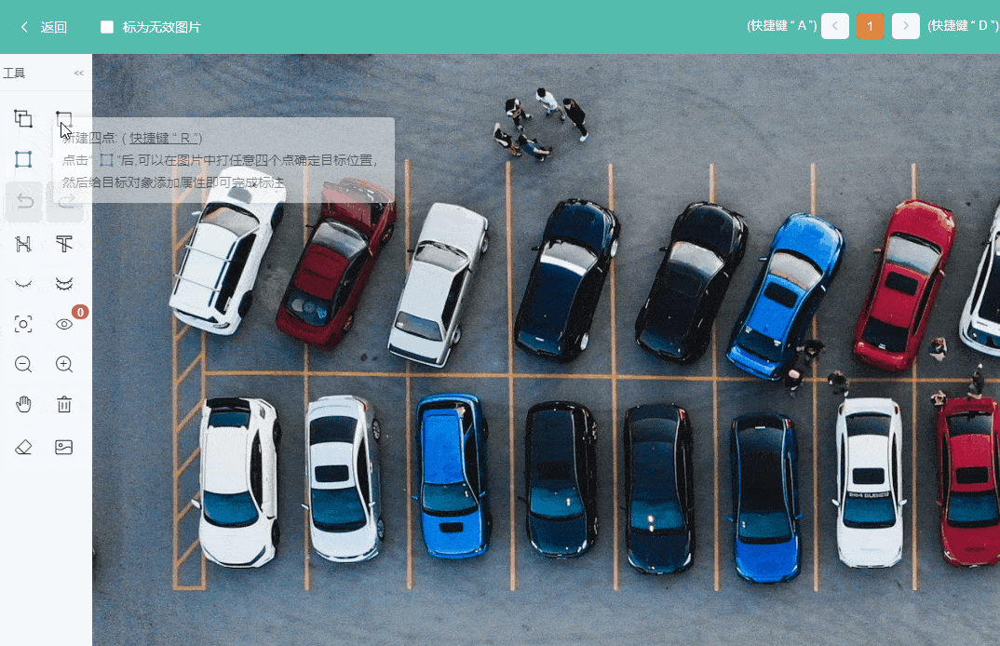

## 交互指南

{ loading=lazy }

!!! note
    3.3.0版本开始支持旋转框

## 常用快捷键

| 按键        | 功能         | 按键 | 功能 |
| ----------- | ------------ | ---- | ---- |
| Q           | 连续画框     | 滚轮；+ / - | 缩放图片 |
| W           | 单个画框     | M | 移动图片 |
| R           | 四点画框     | F | 隐藏类别 |
| S           | 提交         | G | 隐藏属性 |
| A           | 切换上一张图 | H | 隐藏选中 |
| D           | 切换下一张图 | X | 独显选中 |
| Z           | 撤销         | K | 显示全部 |
| V           | 恢复         | C | 清空全部 |
| Delete      | 删除         |      |      |

