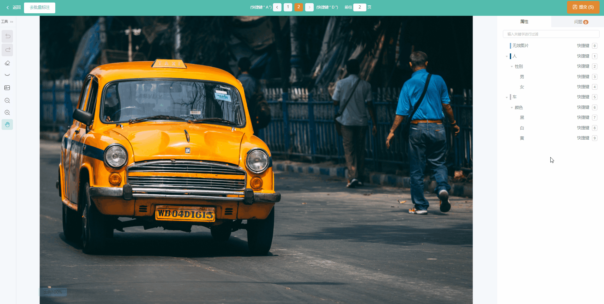
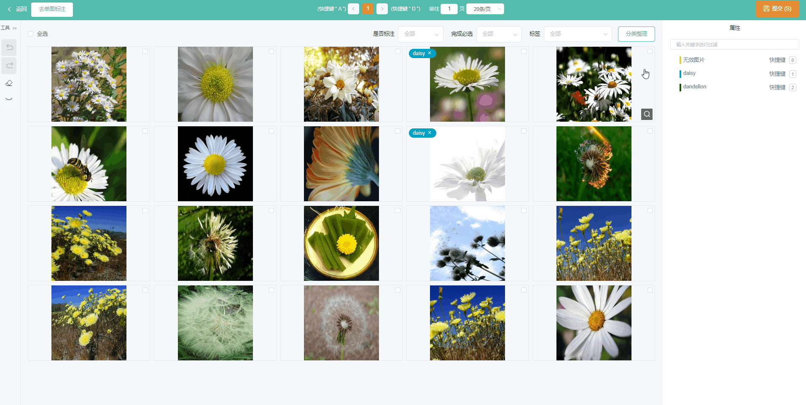

## 交互指南

### 1单图标注

- 点击右侧标签树上的对应按钮给图片打标签

- 左上角显示为提交的标注结果，可以点击直接删除

### 批量标注

#### 1 批量打标签

- 选中多张图片后，点击右侧标签树上的对应按钮就可以给多张图片打上相同的标签

- 在每张缩略图上可以看到已打的标签，也可以删除标签

#### 2 图片详情

点击某张图片放大镜的图标可以跳转到该图片的详情页，同样可以打标签删标签

## 快捷键

| 按键        | 功能          |
| ----------- | ------------- |
| Z           | 撤销          |
| V           | 恢复          |
| C           | 清空标签      |
| F           | 隐藏/显示标签 |
| 滚轮；+ / - | 缩放图片      |
| M           | 移动图片      |