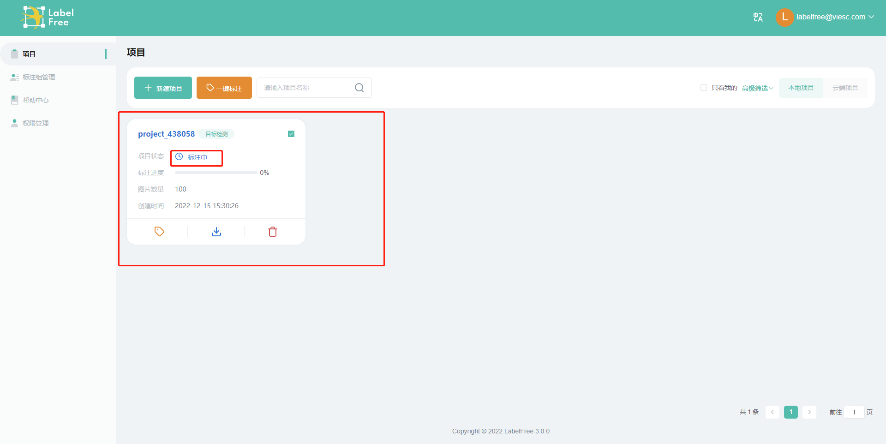

## 1. 创建项目

点击项目界面的【**新建项目**】按钮，跳转至新建项目的标注类型选择界面。

### 2. 基本信息设置

可在基本信息界面设置项目的各项基本信息，参数如下:

- 项目名称：必填，程序默认会产生成一个项目名称，可编辑，不可重名。

- 项目描述：非必填，对项目的基本说明。

在左侧可以选择标注类型：目标检测或语义分割，在右侧标签属性设置可以选择是否复制项目标签。

标注类型设置完成后，点击页面底部的【下一步】，跳转到基本信息页面。

### 3. 标签设置

【**项目标签复制**】选择【**是**】，在【**选择项目**】的框中选择一个已创建的项目，可将该项目的所有标签复制并显示在下方【项目标签】中，且可通过【+】【-】编辑复制过来的标签。同时可手动添加标签，在【**项目标签**】输入框中输入一级标签名，点击【添加】可添加标签类别列表，点击【+】图标可在标签类别下添加二级标签，在二级标签下，点击【+】图标，可以在二级标签下添加三级标签，点击标签后的【-】按钮，可删除该级标签及其子标签。

【**项目标签复制**】选择【**否**】，即不复制其他项目的标签，自行手动添加标签；

- 标注组：非必填，选择标注组，则该项目只被项目组内的成员可见；不选择项目组，则该项目对系统所有用户可见（标注组由管理员在标注组管理模块管理）。

- 项目分组：非必填，选择项目分组，在该项目的详情页可查看同组的项目的示例文档；不选择项目分组，则仅可查看自己的示例文档（项目分组可点击输入框后的【**添加分组**】按钮进行创建）。

- 标注示例：非必填，仅可上传markdown文档，上传后会在【**项目详情**】-【**文档**】下展示，用于指导该项目的标注。

  设置完基本信息后，点击【**下一步**】按钮，跳转到数据集上传界面。

### 4. 数据集上传

可在数据集上传界面设置上传参数：

- 导入标注-包含标注信息：选择包含标注信息，即在上传的zip中包含标注信息，程序会解析上传的标注数据，并在标注时渲染在图片上，目标检测项目支持voc，语义分割项目支持voc与coco（程序界面有格式说明的跳转连接与示例文档，需严格按照示例的格式上传图集，否则会解析失败）。

- 导入标注-不含标注信息：选择不包含标注信息，程序只会解析上传的zip包中的图片，忽略其他文件。

- 上传文件：上传数据集文件，具体格式请参照说明文档与示例，仅支持zip包。

  待数据集文件上传完成后，点击【**保存**】按钮，完成项目的创建，可在项目首页看到新建的项目，待项目图集解析完毕，项目状态变为标注中，即可进行标注操作。

