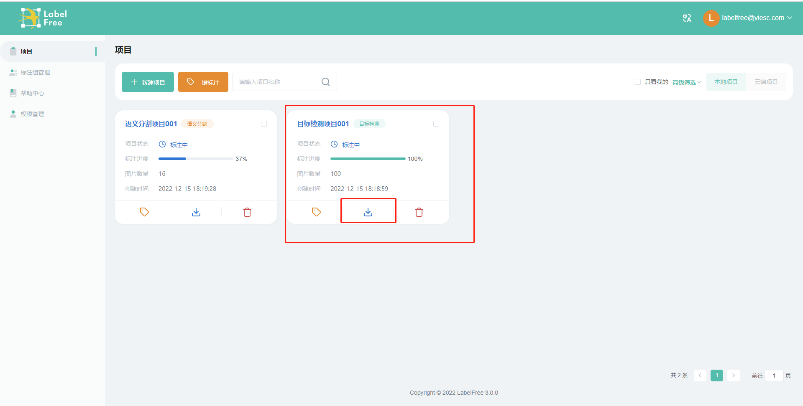
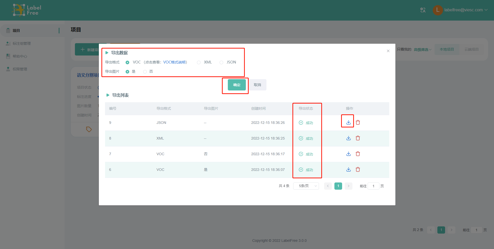
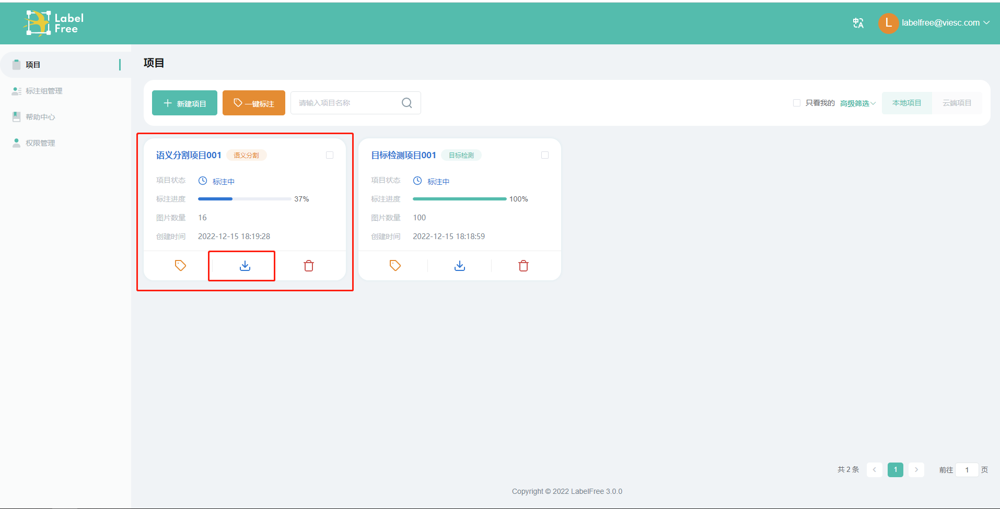
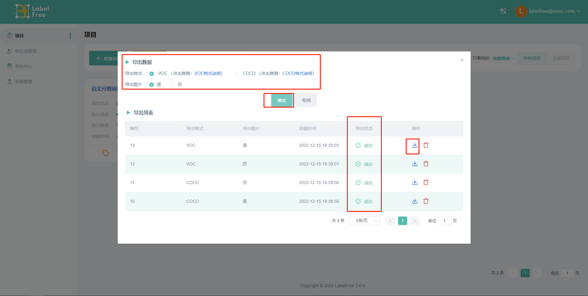

## 数据导出

项目进行了标注后，即可导出标注过的图片及其标注数据（不需要完成整个项目的标注，程序可导出当前标注进度的数据）。

### 目标检测试项目

点击目标检测项目的【**下载**】按钮，可弹出下载弹窗。

在弹窗上选择下载的格式，点击【**确定**】按钮，可在导出列表生成对应下载任务，在任务的状态变为成功后，可点击其【**下载**】按钮，将数据下载到本地。

目标检测支持的下载格式：

- voc格式：可点击弹窗上的格式说明超链查看具体内容，该格式下可选择是否导出图片。
- XML格式：每张图片会生成一个单独的XML文件，以图片名为XML文件名，该格式只会导出XML文件，不会导出图片。
- json格式：将所有标注数据整合到一个json文件中下载，该格式只会导出json文件，不会导出图片。

### 语义分割项目

点击语义分割项目的【**下载**】按钮，可弹出下载弹窗。

在弹窗上选择下载的格式，点击【**确定**】按钮，可在导出列表生成对应下载任务，在任务的状态变为成功后，可点击其【**下载**】按钮，将数据下载到本地。

目标检测支持的下载格式：

- voc格式：可点击弹窗上的格式说明超链查看具体内容，该格式下可选择是否导出图片。
- coco格式：可点击弹窗上的格式说明超链查看具体内容，该格式下可选择是否导出图片。

