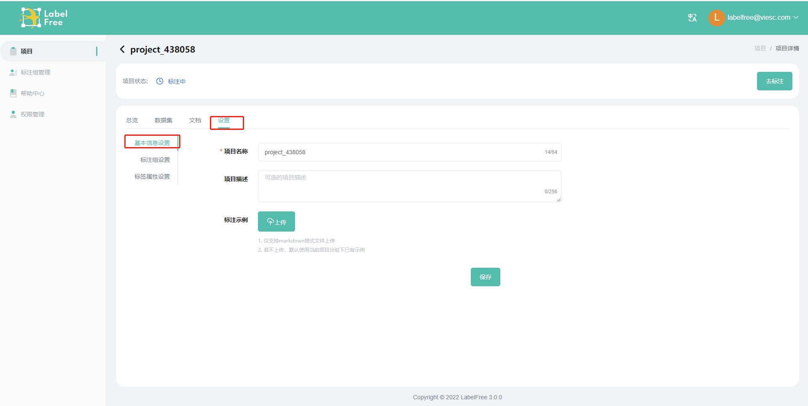

## 项目详情

在项目首页点击项目名称，可跳转到项目详情页，默认进入【**总览**】页面。

### 总览

总览页面可查看当前项目的标注情况，可分为项目整体视角与当前用户视角，具体参数如下：

- 已标注图片/标注框：项目已标注的图片数量（包括负样本与无效图片）与标注框的总数，标注框数量不统计负样本与无效图片（labelfree系统将负样本与无效图片也定义标注框）。
- 未标注：项目当前剩余未标注的图片数。
- 待修正：当前社区版该字段无意义。
- 已完成：已标注图片数量与项目总图片数量的比值。
- 标签列表：项目中已标注的标签的列表，会展示标签的名称，数量及其占比（其中**labelfree_invalid_data**与**负样本**为系统给无效图片和负样本标注定义的标签名）。

### 数据集

数据集页面展示的是项目图片的预览效果，默认缩略图展示所有图片，可点击放大预览。

已标注的图片会在其缩略图上渲染出标注框。

可通过标注状态，标注员，标签进行筛选（标注状态选择已标注才可选择标注员）。

### 文档

文档页面展示的是创建项目时在基本信息中上传的示例文档，若当前项目没有上传，则展示同组最新上传的文档，无则为空。

该文档在**设置**中可再次上传，若多次上传，则以项目名_V1,V2,V3.....的形式命名，在该页可下拉选择查看各个版本的文档。

### 设置

设置界面可以对项目的基本信息，标注组与标签进行编辑。

#### 基本信息设置

进本信息设置中可编辑项目名称，项目描述，再次上传示例文档，点击保存即可更新项目信息（再次上传示例文档，会生成一个新的版本（项目名称_v2），之前上传的文档会留档，可在**文档**页面查看）。

#### 标注组设置

标注组设置中可编辑项目关联的标注组。

#### 标签属性设置

标签属性设置中可新增标签，但不可删除。

#### 去标注

点击页面忧伤的【**去标注**】按钮，可跳转到标注界面。

