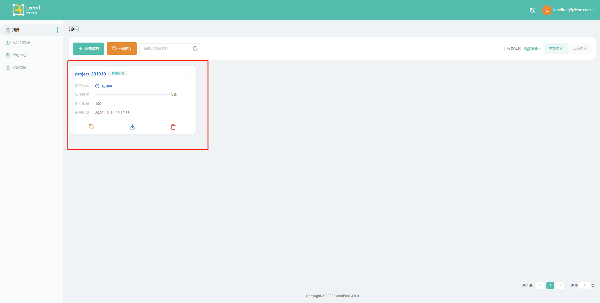

在LabelFree中，数据集上传，标注，标注结果下载都是通过项目管理。进行标注操作，需要先创建项目（示例为快速创建项目，具体参数项释义及设置规则请移步`用户手册`。
!!! note
    如发现无法新建项目，请确认使用的是默认管理员账号登陆。
    新注册账号默认为标注员，无新建项目权限。

1. 进入到【**项目**】界面，点击【**新建项目**】按钮，跳转至【**基础信息**】界面

2. 点击【**下一步**】，跳转至【**标签管理**】界面

3. 点击【**下一步**】，跳转至【**其它信息**】界面

4. 点击【**下一步**】进入【**上传数据集**】界面
     - 包含预标注，需要上传相应格式的数据集
     - 不包含预标注，可以上传任意格式的`zip`压缩包，LabelFree会自动解压缩并解析所有图片文件

5. 完成数据集上传，点击【**保存**】，即可完成项目的快速创建。

