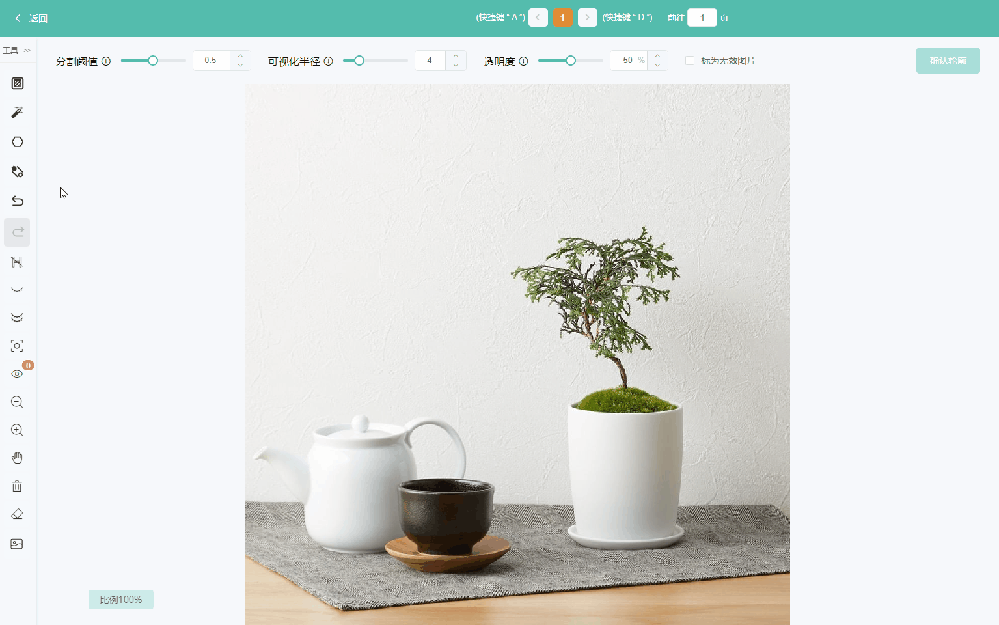
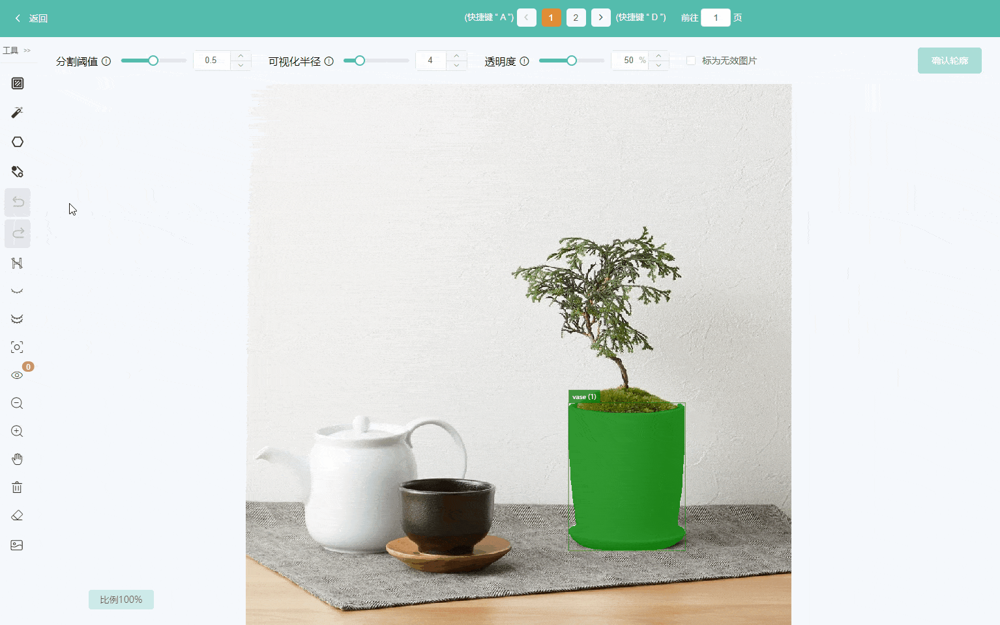

## 交互指南
### 1 辅助分割

左键选中区域，右键排除区域，达到预期效果后点击“确认轮廓”

{ loading=lazy }

### 2 绘制多边形

{ loading=lazy }

### 3 选定区域辅助分割

针对图像过大、背景复杂的情况，可以选定一个区域进行辅助分割，排除其他影响因素

{ loading=lazy }

### 4 掩膜转多边形

算法结果需要调整，可以将掩膜转为多边形后，对多边形进行微调

{ loading=lazy }

## 快捷键
!!! tip inline end
    这里仅列出了分割标注特有的操作快捷键，常规快捷键与目标检测相同

| 按键       | 功能             |
| ---------- | ---------------- |
| Q          | 选定区域         |
| W          | 绘制正负样本点   |
| 鼠标左键   | 增加正样本点     |
| 鼠标右键   | 增加负样本点     |
| T          | 目标轮廓转多边形 |
| R          | 绘制多边形       |
| 鼠标单击边 | 添加多边形的点   |
