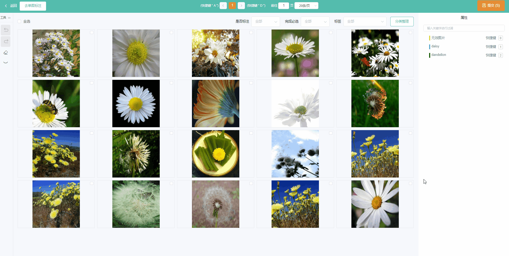

# 欢迎使用LabelFree👋👋👋

LabelFree 是一个操作便捷、支持多人协作、高性能的数据标注系统。

## 1 特性

- **简单**。简化概念，快速上手，只为数据标注。
- **高性能**。支持**超大数据集标注**、流畅**多人在线标注**体验。
- **智能**。内置算法模型，支持**交互式辅助分割标注**，提高10×标注效率🚀🚀🚀。
- **通用**。支持VOC、COCO等主流数据集格式导出。
- **开放**。支持**免费私有化部署**，数据安全可靠。
- **一键标注**。提供专业、一站式的数据标注服务。

<table>
    <tr>
        <td></td>
        <td></td>
        <td></td>
    <tr>
    <tr>
        <td align="center">目标检测</td>
        <td align="center">图像分割</td>
        <td align="center">图像分类</td>
    <tr>
</table>

## 2 更新日志
4.0.0更新内容：

### 新功能：
- 支持图像分类标注
- 支持批量标注
- 支持预标注多级标签导入

### 优化:

- 全面提升标注相关查询速度，优化标注体验
- 提升数据加载性能

### 修复:
- zip包中包含中文小概率发生乱码问题